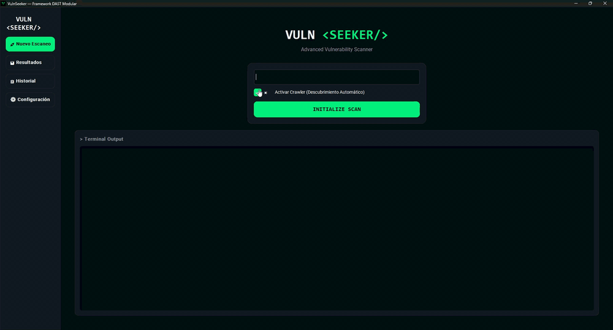
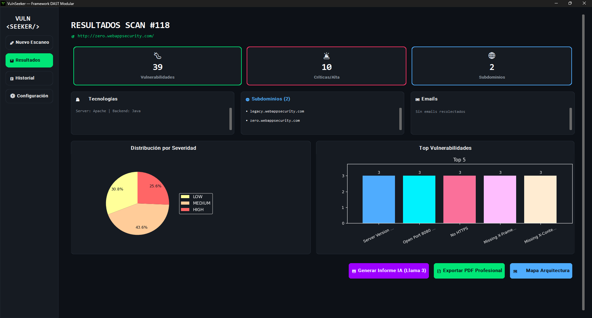
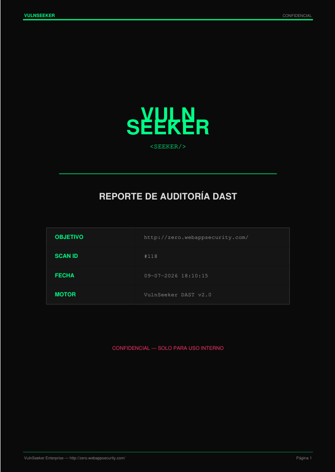

<div align="center">

```
██╗   ██╗██╗   ██╗██╗     ███╗   ██╗███████╗███████╗███████╗██╗  ██╗███████╗██████╗
██║   ██║██║   ██║██║     ████╗  ██║██╔════╝██╔════╝██╔════╝██║ ██╔╝██╔════╝██╔══██╗
██║   ██║██║   ██║██║     ██╔██╗ ██║███████╗█████╗  █████╗  █████╔╝ █████╗  ██████╔╝
╚██╗ ██╔╝██║   ██║██║     ██║╚██╗██║╚════██║██╔══╝  ██╔══╝  ██╔═██╗ ██╔══╝  ██╔══██╗
 ╚████╔╝ ╚██████╔╝███████╗██║ ╚████║███████║███████╗███████╗██║  ██╗███████╗██║  ██║
  ╚═══╝   ╚═════╝ ╚══════╝╚═╝  ╚═══╝╚══════╝╚══════╝╚══════╝╚═╝  ╚═╝╚══════╝╚═╝  ╚═╝
```

[](https://github.com/palmar973/VulnSeeker/actions/workflows/ci.yml)

**Modular Web Vulnerability Scanner**

[🇪🇸 Español](README.md) · 🇬🇧 **English**

[](https://www.python.org/)
[](https://github.com/palmar973/VulnSeeker/tree/main/tests)
[](https://github.com/palmar973/VulnSeeker/tree/main/modules)
[](https://owasp.org/www-project-top-ten/)
[](LICENSE)

[](https://groq.com/)
[](https://nvd.nist.gov/)

<!-- Project screenshots: drop the files into docs/img/ and these markers will render the images -->






</div>

---

## 🔍 What is VulnSeeker?

**VulnSeeker** is an advanced DAST (Dynamic Application Security Testing) framework, written in Python, designed to run comprehensive automated security audits. Unlike basic scanners limited to a single attack vector, VulnSeeker orchestrates **25 independent analysis modules** — from SQL injection and XSS to OSINT subdomain reconnaissance, real-time CVE lookups against the NIST NVD, and Artificial Intelligence analysis.

The system runs on an extensible modular architecture where every module inherits from the base `ScannerModule` class and registers itself with the central engine, allowing new scanning capabilities to be added without modifying the system core.

### Why VulnSeeker?

- **Integrated coverage.** VulnSeeker runs a full chain: reconnaissance → fingerprinting → crawling → API-aware discovery → multi-threaded attack → deduplication → AI analysis → report.
- **API-aware discovery (SPAs).** When the target is a Single-Page Application (Angular/React/Vue) whose static crawling reveals no endpoints, VulnSeeker recovers the API surface by parsing the OpenAPI/Swagger specification and extracting `/api/` and `/rest/` routes from the JavaScript *bundles* —without a *headless* browser— and also attacks JSON bodies.
- **Robustness against false positives.** It detects *catch-all* responses (soft-404) so it won't report non-existent files on servers that answer 200 to everything (typical of SPAs), and it validates against a *baseline* in the injection modules.
- **8/10 OWASP Top 10 (2021) categories.** The remaining 2 (A08, A09) are not externally assessable via DAST.
- **Built-in Artificial Intelligence.** Llama 3.3 70B performs a contextual analysis of the technical findings and prioritizes them by business risk.
- **Real-time CVEs.** Integration with the NIST NVD API 2.0 to look up known vulnerabilities associated with the detected technologies.
- **194 unit tests.** Full suite with `pytest` and a CI/CD pipeline on GitHub Actions.
- **Validated against the OWASP Benchmark.** Quantitative measurement with labeled *ground truth*: Youden Index 0.68 on the attackable subset (SQLi 0.89, XSS 0.87, Precision 0.95), reported with methodological honesty.
- **Historical persistence.** Every scan is stored in SQLite, enabling trend analysis and comparison across audits.

---

## ⚡ Detection Modules

### Injection & Execution (A03 + A10 — Injection / SSRF)

| Module | Description | Severity |
|--------|-------------|----------|
| **SQL Injection** | Error-based SQLi (MySQL, PostgreSQL, Oracle, MSSQL, SQLite/ORM), blind *time-based*, and injection into JSON bodies of REST APIs | 🔴 CRITICAL |
| **Cross-Site Scripting** | Reflected XSS in GET parameters and POST forms via canary injection | 🟠 HIGH |
| **Command Injection** | Remote command execution (RCE) detection: in-band and blind *time-based* | 🔴 CRITICAL |
| **Local File Inclusion** | Directory traversal tests to read local files | 🔴 HIGH |
| **Remote File Inclusion** | Detection of remote file inclusion in web applications | 🔴 HIGH |
| **SSRF Scanner** | In-band heuristic detection of Server-Side Request Forgery | 🔴 HIGH |

### Access Control & Authentication (A01 + A07)

| Module | Description | Severity |
|--------|-------------|----------|
| **Open Redirect** | Detection of exploitable open redirects | 🟠 HIGH |
| **CORS Scanner** | Analysis of misconfigured Cross-Origin policies | 🟡 MEDIUM |
| **CSRF Auditor** | Verification of anti-forgery protection in forms | 🟡 MEDIUM |
| **Brute Force Detector** | Detection of endpoints without brute-force protection | 🟠 HIGH |
| **Weak Session Auditor** | Session management audit (entropy, rotation, tokens) | 🟠 HIGH |

### Configuration & Hardening (A05 — Security Misconfiguration)

| Module | Description | Severity |
|--------|-------------|----------|
| **Header Analyzer** | Evaluation of security headers (CSP, HSTS, X-Frame-Options, etc.) | 🟡 MEDIUM |
| **Dir Listing Detector** | Detection of enabled directory listing | 🟡 MEDIUM |
| **HTTP Method Scanner** | Identification of dangerous enabled HTTP methods (PUT, DELETE, TRACE) | 🟡 MEDIUM |
| **Cookie Scanner** | Audit of session cookie security flags (Secure, HttpOnly, SameSite) | 🟡 MEDIUM |
| **Path Fuzzer** | Discovery of exposed sensitive files and paths (.env, .git, SQL backups, admin panels) with *soft-404* validation | 🟠 HIGH |

### Vulnerable Components & Cryptography (A02 + A06)

| Module | Description | Severity |
|--------|-------------|----------|
| **CVE Lookup** | Local database + live query to the NIST NVD API 2.0 | 🔴 CRITICAL |
| **TLS Checker** | Validation of SSL/TLS certificates, protocols and weak ciphers | 🟠 HIGH |
| **Sensitive Data Scanner** | Detection of secrets and sensitive data in responses (API keys, tokens, credentials, cards, connection strings) | 🟠 HIGH |
| **CMS Auditor** | CMS-specific tests based on the detected CMS (e.g. WordPress user enumeration) | 🟡 MEDIUM |

### Insecure Design (A04)

| Module | Description | Severity |
|--------|-------------|----------|
| **File Upload Detector** | Detection of file-upload forms without validation | 🟠 HIGH |

### Reconnaissance & Infrastructure

| Module | Description | Severity |
|--------|-------------|----------|
| **Port Scanner** | Scan of open TCP ports with service identification | 🔵 INFO |
| **WAF Detector** | Identifies web firewalls (Cloudflare, AWS WAF, Akamai, Imperva) via passive header analysis | 🔵 INFO |
| **Subdomain Takeover** | Detects subdomains pointing to unclaimed third-party services (S3, GitHub Pages, Heroku…) | 🔴 HIGH |
| **Email Harvester** | Collects public emails to assess the social-engineering surface | 🔵 INFO |

> The **25 modules** above are the ones registered in `core/module_registry.py` (`get_default_modules()`): 6 injection + 5 access control/authentication + 5 configuration + 4 vulnerable components/cryptography + 1 insecure design + 4 reconnaissance & infrastructure.

### Pipeline Components (core)

These stages feed the modules and are **not** counted among the 25 scanners:

| Component | Description |
|-----------|-------------|
| **Web Crawler** | Structural explorer that maps URLs, forms and entry points with authentication support |
| **API Endpoint Discovery** | Recovers REST API endpoints in SPAs without a browser: OpenAPI/Swagger parsing + route extraction from JavaScript *bundles* |
| **Tech Fingerprinter** | Identification of server, backend language, CMS/Framework and versions |
| **Subdomain OSINT** | Passive subdomain discovery via crt.sh and HackerTarget with live-host validation |

### Artificial Intelligence

| Feature | Detail |
|---------|--------|
| **Model** | Llama 3.3 70B via Groq API |
| **Function** | Generation of executive reports with business-risk analysis |
| **Output** | Global risk level, top threats, immediate action plan (48h) and strategic recommendations |

### Reports

- 📄 **Professional PDF** with cover page, severity charts (pie + bars), findings table and AI summary
- 📊 **JSON** structured for integration with other tools
- 📋 **CSV** Excel-compatible for manual analysis
- 🗄️ **SQLite** with the full scan history, exportable and queryable

---

## 🏗️ Architecture

```
VulnSeeker/
├── core/                         # System core
│   ├── engine.py                 # Main orchestrator (multi-threaded)
│   ├── models.py                 # Base types: Target, Vulnerability, ScannerModule, Severity
│   ├── module_registry.py        # Central registry of the 25 modules
│   ├── config.py                 # Centralized global configuration
│   ├── crawler.py                # Web Crawler with cookie authentication
│   ├── api_discovery.py          # API endpoint discoverer (SPAs, no browser)
│   ├── soft404.py                # Catch-all response detection (anti-FP)
│   ├── fingerprinter.py          # Technology fingerprinting (Server/CMS/Backend)
│   ├── subdomain_scanner.py      # Subdomain OSINT (crt.sh + HackerTarget)
│   └── db_manager.py             # SQLite persistence (Singleton)
│
├── modules/                      # 25 registered modules + 3 auxiliary
│   ├── sqli_module.py            # SQL Injection (error-based + blind time-based + JSON)
│   ├── xss_module.py             # Reflected XSS (GET + POST)
│   ├── cmd_injection.py          # Command Injection / RCE (in-band + time-based)
│   ├── lfi_scanner.py            # Local File Inclusion
│   ├── rfi_scanner.py            # Remote File Inclusion
│   ├── ssrf_scanner.py           # Server-Side Request Forgery (SSRF)
│   ├── open_redirect.py          # Open Redirect
│   ├── cors_scanner.py           # CORS Misconfiguration
│   ├── csrf_auditor.py           # Cross-Site Request Forgery
│   ├── brute_force_detector.py   # Brute Force Protection Audit
│   ├── weak_session_auditor.py   # Session Management Audit
│   ├── cookie_scanner.py         # Cookie Security Audit
│   ├── header_analyzer.py        # HTTP Security Headers
│   ├── dir_listing_detector.py   # Directory Listing Detection
│   ├── http_method_scanner.py    # Dangerous HTTP Methods
│   ├── path_fuzzer.py            # Path Fuzzing (.env, .git, backups, panels)
│   ├── sensitive_data_scanner.py # Sensitive Data Exposure (keys, tokens, PII)
│   ├── cve_lookup.py             # CVE Lookup (local DB + NVD API 2.0)
│   ├── tls_checker.py            # TLS/SSL Certificate Analyzer
│   ├── cms_auditor.py            # CMS-Specific Vulnerabilities
│   ├── file_upload_detector.py   # Insecure File Upload Detection
│   ├── port_scanner.py           # TCP Port Scanner
│   ├── waf_detector.py           # WAF Detection
│   ├── subdomain_takeover.py     # Subdomain Takeover
│   ├── email_harvester.py        # Email Harvesting (OSINT)
│   ├── injection_points.py       # Shared injection-vector component
│   ├── tech_visualizer.py        # Technology visualization utility
│   └── ai_analyst.py             # AI Analyst (Groq / Llama 3.3 70B, auxiliary service)
│
├── ui/                           # Graphical interface
│   └── main_window.py            # Full GUI (CustomTkinter + Matplotlib)
│
├── reports/                      # Reporting system
│   ├── report_generator.py       # JSON/CSV exporter
│   └── pdf_generator.py          # PDF generator (ReportLab + charts)
│
├── tests/                        # 194 unit tests across 34 files (pytest)
│   ├── test_sqli.py
│   ├── test_xss.py
│   ├── test_cmd_injection.py
│   ├── test_cve_lookup.py
│   ├── ...                       # 34 test_*.py files
│   └── test_weak_session.py
│
├── tools/                        # Quantitative evaluation utilities
│   ├── benchmark_scorer.py       # Metrics vs OWASP Benchmark (TPR/FPR/Youden)
│   └── benchmark_runner.py       # Driver: enumerates and attacks the Benchmark cases
│
├── .github/workflows/ci.yml     # CI/CD Pipeline (GitHub Actions)
├── tesis/                       # Thesis document (LaTeX + PDF)
│   └── main.tex / main.pdf
├── main.py                      # CLI entry point
├── gui.py                       # GUI entry point
├── requirements.txt             # Project dependencies
└── requirements-dev.txt         # Development dependencies (pytest)
```

### Execution Flow

```
[Target URL]
      │
      ▼
┌─────────────────┐
│ Subdomain OSINT  │ ← crt.sh + HackerTarget
└────────┬────────┘
         ▼
┌─────────────────┐
│  Fingerprinting  │ ← Headers + HTML + predictive paths
└────────┬────────┘
         ▼
┌─────────────────┐
│    Web Crawler   │ ← URLs + forms + parameters (authenticated)
└────────┬────────┘
         ▼
┌──────────────────────────────────────────────┐
│ MULTI-THREAD ATTACK (25 modules in parallel) │
│  ┌────────┐ ┌────────┐ ┌──────────────────┐ │
│  │ SQLi   │ │  XSS   │ │ Header Analyzer  │ │
│  │ LFI    │ │  RFI   │ │ CORS Scanner     │ │
│  │ RCE    │ │  SSRF  │ │ CSRF Auditor     │ │
│  │ CVE*   │ │  TLS   │ │ Brute Force      │ │
│  │ Upload │ │ Redirect│ │ Weak Session     │ │
│  └────────┘ └────────┘ └──────────────────┘ │
│  *CVE: NVD API 2.0 + local DB (16 CVEs)      │
└─────────────────┬────────────────────────────┘
                  ▼
┌──────────────────────────────────────────────┐
│  DEDUPLICATION (name + URL + payload)        │
│  Removes exactly identical findings          │
└─────────────────┬────────────────────────────┘
                  ▼
┌──────────────────────────────────────────────┐
│     AI ANALYSIS (Llama 3.3 70B via Groq)     │
│       Executive Report + Business Risk       │
└─────────────────┬────────────────────────────┘
                  ▼
       ┌──────────┴──────────┐
       │  PDF · JSON · CSV   │
       │  SQLite (History)   │
       └─────────────────────┘
```

### OWASP Top 10 (2021) Coverage

| # | OWASP Category | Module(s) | Status |
|---|----------------|-----------|:------:|
| A01 | Broken Access Control | Open Redirect, CORS Scanner | ✅ |
| A02 | Cryptographic Failures | TLS Checker, Sensitive Data Scanner | ✅ |
| A03 | Injection | SQLi, XSS, Command Injection, LFI, RFI, SSRF* | ✅ |
| A04 | Insecure Design | File Upload Detector | ✅ |
| A05 | Security Misconfiguration | Headers, Dir Listing, HTTP Methods, Cookie Scanner, Path Fuzzer | ✅ |
| A06 | Vulnerable Components | CVE Lookup (NVD API), CMS Auditor, Tech Fingerprinter | ✅ |
| A07 | Auth Failures | CSRF, Brute Force, Weak Session | ✅ |
| A08 | Software & Data Integrity | — | ⬜ Not externally assessable |
| A09 | Logging & Monitoring | — | ⬜ Not externally assessable |
| A10 | SSRF | SSRF Scanner | ✅ |

> *\*SSRF is officially classified as A10 in the OWASP Top 10 (2021), but it is also grouped under A03 due to its server-side injection nature.*

---

## 🧪 Tests

VulnSeeker ships with **194 unit tests** organized across 34 test files. Every module is covered with tests that mock HTTP responses to guarantee deterministic, network-independent execution.

```bash
# Run the full suite
pytest tests/ -v

# Expected result
194 passed ✅
```

Continuous integration runs the full suite on every push via **GitHub Actions**.

---

## 🎯 Benchmark: VulnSeeker vs OWASP ZAP

> **A modular academic scanner matches the reference DAST tool under an identical measurement on the OWASP Benchmark v1.2.**

The [OWASP Benchmark](https://owasp.org/www-project-benchmark/) v1.2 is a suite of 2,740 labeled test cases (*ground truth*) that allows a scanner's accuracy to be measured objectively. VulnSeeker was pitted against **OWASP ZAP** —the industry's reference open-source DAST scanner— on exactly the same subset of cases and with an identical measurement protocol. The metric is the **Youden Index** (J = TPR − FPR), which penalizes false negatives and false positives equally.

| Measurement | Cases | VulnSeeker | OWASP ZAP |
|-------------|:-----:|:----------:|:---------:|
| **Global Youden** | 1,478 | **0.39** | 0.38 |
| **Youden (attackable subset)** | 918 | **0.68** | 0.64 |
| SQLi *(attackable)* | — | 0.89 | **0.97** |
| XSS *(attackable)* | — | **0.87** | **0.87** |
| Command Injection *(attackable)* | — | **0.46** | 0.00 |
| Path Traversal *(attackable)* | — | 0.00 | 0.00 |

**An honest reading of the results:**

- **Global technical tie** (0.39 vs 0.38) and a slight edge for VulnSeeker on the attackable subset (0.68 vs 0.64).
- On **SQLi**, ZAP scores a better Youden **not by detecting more** —both reach a sensitivity (TPR) of 1.00— but by producing **fewer false positives**. Even so, VulnSeeker's precision stays high (0.95).
- On **Command Injection**, VulnSeeker wins on **sensitivity**: it detects cases ZAP does not report (0.46 vs 0.00).
- On **XSS** there is an exact tie (0.87), and on **Path Traversal** both scanners are blind against the benchmark's synthetic oracle (0.00).

Full methodology, confusion matrices and per-class analysis in the [`tesis/` folder](tesis/) (thesis document and comparative article).

---

## ⚠️ Known Limitations

- **Heuristic detection:** The injection modules combine *error-based* techniques, blind *time-based* detection (SQLi and command injection), JSON-body injection and a shared vector component (`injection_points`). Stored XSS and DOM XSS are not detected yet, as they require state tracking or client-side JavaScript execution.
- **In-band SSRF:** Detection through HTTP response analysis; it does not use OOB (Out-of-Band) callbacks.
- **Subdomains as recon:** Subdomains discovered via OSINT are not scanned automatically (that requires explicit authorization).
- **AI depends on an API:** The executive report requires connectivity to the Groq API; the rest of the framework works offline.
- **SPAs without a spec or readable routes:** API-aware discovery covers SPAs that publish OpenAPI/Swagger or reference their routes in JavaScript; those that fully obfuscate their endpoints would require a *headless* rendering engine (future work).
- **Validation in a controlled environment:** 0 false positives observed against DVWA (low security), with additional validation against Altoro Mutual and the OWASP Juice Shop SPA; results may vary in production.
- **Limits quantified against the OWASP Benchmark:** the *ground-truth* measurement revealed that VulnSeeker is blind to *path traversal* and to *command injection* without reflection, and that it does not cover header- or XML-body injection vectors (≈34% of the cases). Blind *time-based* (cmdi) and *error-based* (LFI) techniques were added for those cases, but it was empirically verified that the synthetic benchmark **does not expose them**: it neither blocks the response with the command delay (`sleep 10` → ~0.06 s) nor propagates the file-error trace. Their effectiveness materializes in real apps (DVWA), not in the oracle. The lack of `POST` XSS that the measurement uncovered was indeed fixed by extending the module (XSS Youden 0.38 → 0.87). These are improvement lines that can be tackled without touching the modular architecture.

For more detail, see the Study Limitations section in the [thesis document](tesis/main.pdf).

---

## 🚀 Installation

### Prerequisites
- Python 3.10+
- pip (package manager)
- *(Optional)* A [Groq](https://console.groq.com/) API Key for the AI module

### Steps

```bash
# 1. Clone the repository
git clone https://github.com/palmar973/VulnSeeker.git
cd VulnSeeker

# 2. Create a virtual environment
python -m venv .venv

# 3. Activate the virtual environment
# Windows:
.venv\Scripts\Activate.ps1
# Linux/macOS:
source .venv/bin/activate

# 4. Install dependencies
pip install -r requirements.txt

# 5. (Optional) Install development dependencies
pip install -r requirements-dev.txt

# 6. Run the GUI
python gui.py
```

### CLI Usage

```bash
# Simple scan (single URL)
python main.py -u http://target.com

# Scan with the Crawler (automatic endpoint discovery)
python main.py -u http://target.com --crawl
```

---

## 🌐 About vulnseeker.software

The website [vulnseeker.software](https://vulnseeker.software) is **exclusively a landing page** presenting and documenting the project. VulnSeeker is a **local desktop application** — there is not and will not be a browser-executable version.

This is a deliberate decision: a vulnerability scanner requires direct network access, unrestricted multi-threaded execution beyond browser constraints, and the ability to issue hundreds of concurrent HTTP requests with full control over headers, timeouts and payloads. The local architecture guarantees **maximum scanning power** and **full operator control** over the tool.

---

## 📚 Academic Context

VulnSeeker is developed as an undergraduate thesis (Trabajo de Grado) for the **Bachelor's Degree in Computer Science** at the **Faculty of Experimental Sciences, University of Zulia**, Maracaibo, Venezuela.

**Title:** *Modular Scanner for the Automated Detection of Vulnerabilities in Web Applications*

**Author:** Claudio Enrique Palmar León · **Advisor:** Prof. Sigerist Rodríguez

---

## ⚠️ Legal Disclaimer

```
VulnSeeker has been developed for STRICTLY educational and academic-research purposes.

Using this tool against systems without EXPLICIT, WRITTEN AUTHORIZATION from the owner
is ILLEGAL and may constitute a crime under the laws of your jurisdiction.

The author is not responsible for any misuse of this tool.
Use it exclusively in controlled environments, test labs or with formal authorization.
```

---

## 📄 License

This project is licensed under the [MIT License](LICENSE).

Developed by **Claudio Enrique Palmar León** · 2025-2026

---

<div align="center">

*“Security is not a product, it's a process.”* — Bruce Schneier

</div>
